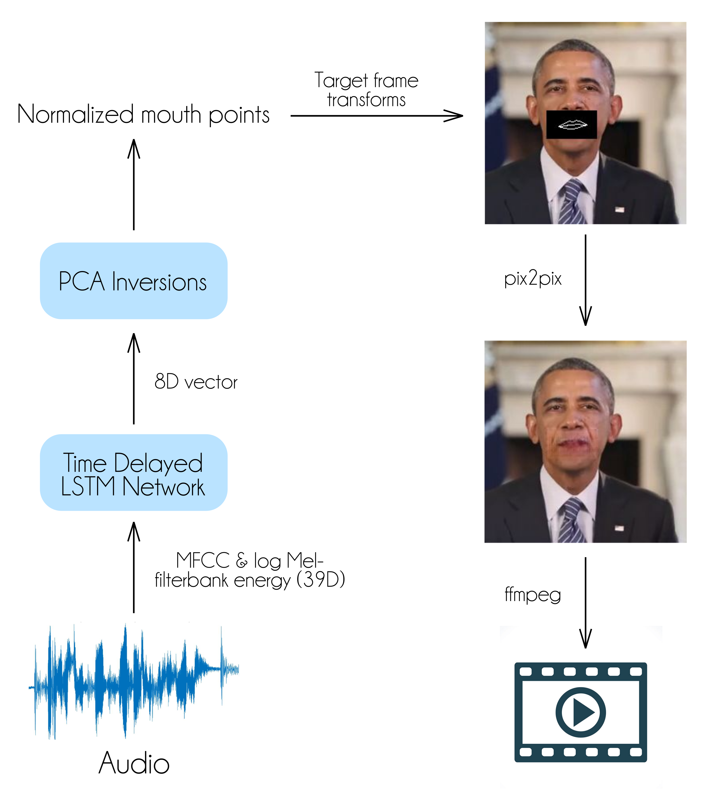

# Obama-Lip-Sync
An implementation of ObamaNet: Photo-realistic lip-sync from text (Kumar, Rithesh, et al. "ObamaNet: Photo-realistic lip-sync from text." arXiv preprint arXiv:1801.01442. 2017.). All relevant data can be found in the data folder.


To generate mouth shape given audio run 
```
python run.py --sf sampleAudio.wav --mf path/obama.h5 --lb 10
````

To use pix2pix run 
```
python pix2pix.py --mode test --output_dir test_output/ --input_dir output/ --checkpoint Pix2PixModel/
```

To generate final video run 
```
ffmpeg -r 32 -f image2 -s 256x256 -i test_output/images/%d-outputs.png -vcodec libx264 -crf 25 outputa.mp4
ffmpeg -i outputa.mp4 -i sampleAudio.wav -c:v copy -c:a aac -strict experimental output.mp4
```


